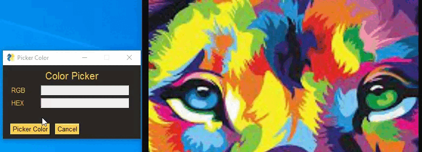

# color-picker-on-the-screen
#### Identify hexadecimal and rgb codes of images on your screen with just a few clicks.

install the requirements before running the application: `pip install -r requirements.txt`

    

